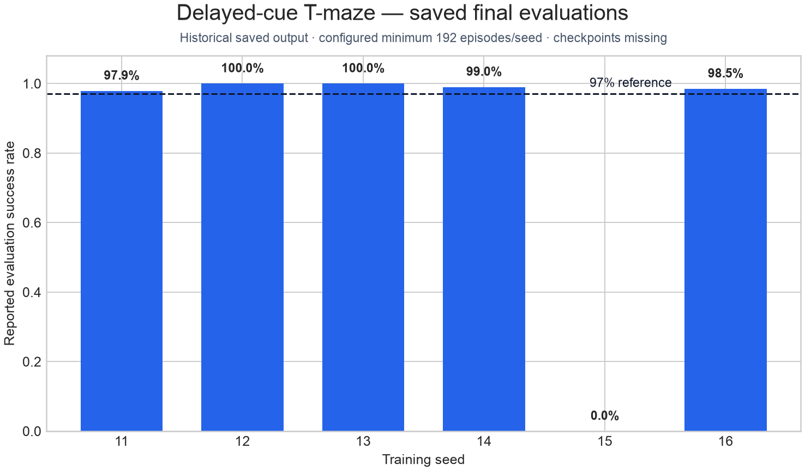
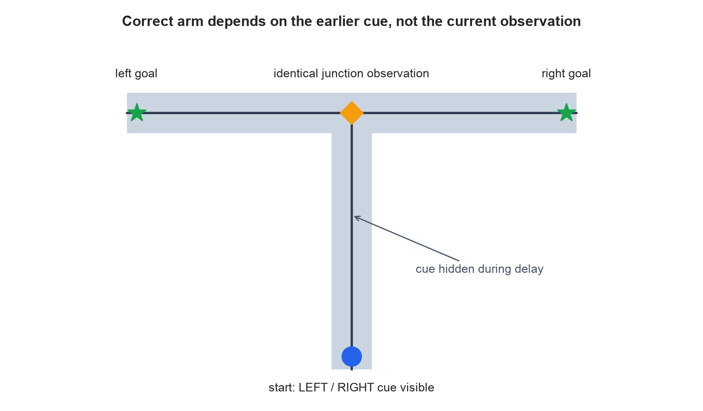

# Ghost

**A continual-learning spiking architecture for agents with persistent memory.**

Ghost is an experimental PyTorch architecture investigating agents that learn
continuously through interaction rather than strictly separating training and
deployment. It combines recurrent spiking dynamics, persistent internal
memory, predictive representations, strategy-conditioned behavior, and online
eligibility-based credit assignment.

## Current result

On a sparse-reward non-vision delayed-cue T-maze, saved experiment output shows
that **five independently trained seeds exceeded 97% evaluation success**
(97.9%–100.0%, configured minimum 192 episodes per seed). A sixth seed failed
at 0.0%, making the mean across all six runs **82.56%**. Reporting the failed
run is essential: this is evidence of strong learned policies, not yet a robust
six-seed reproduction.

| Seed | Training transitions | Evaluation success | Wrong | Evidence |
|---:|---:|---:|---:|---|
| 11 | 65,536 | 97.9% | 2.1% | Saved Marimo output |
| 12 | 65,536 | 100.0% | 0.0% | Saved Marimo output |
| 13 | 65,536 | 100.0% | 0.0% | Saved Marimo output |
| 14 | 65,536 | 99.0% | 0.0% | Saved Marimo output |
| 15 | 65,536 | 0.0% | 0.0% | Failed/timeout run |
| 16 | 65,536 | 98.5% | 0.5% | Saved Marimo output |

The saved session used three-decimal reporting and did not save the six model
states. The historical three-seed checkpoint is tensor-incompatible with the
committed source, so these numbers are **historical verified output, not yet a
checkpoint-reproducible release result**. The six trained states were not
saved, and the historical checkpoint is incompatible with the current source;
exact checkpoint reproduction therefore remains future work.



## Why the task requires memory

```text
cue visible (left/right)
           ↓
cue disappears after two decisions
           ↓
agent navigates the shared corridor
           ↓
same current observation at the junction
           ↓
choose left or right?
```

At the final branch, the current physical observation does not identify the
correct goal. A successful policy must carry task-relevant cue information
through the delay. The cue is excluded from the observation after the first
two decisions; tests lock down that property.



## Architecture

```text
Observation → spiking encoder → latent ───────────────┐
                                  │                   │
                                  ▼                   ▼
                         stateful predictor → feedback
                                  │                   │
                                  └──────→ stateful strategizer / memory
                                                    │
                            latent + strategy + outcome estimate
                                                    ▼
                                             spiking actor → action
                                                    │
                 reward / TD error → eligibility-modulated online updates
```

- The **encoder** maps the 15-value observation through a multi-tick LIF block
  and conventional normalization/projection heads.
- The **predictor** retains recurrent LIF state and predicts the next latent;
  prediction change and error feed the strategizer.
- The **strategizer** combines current latent, predictor feedback, recurrent
  state, and an explicit gated strategy memory.
- The **actor** conditions a spiking policy on the current latent, strategy,
  desirability, and outcome uncertainty.
- **Eligibility traces** carry selected predictor, policy, strategy, and
  encoder credit across otherwise detached decisions; sparse TD error
  modulates reward traces.

The LIF cores and surrogate spike function are genuinely spiking components.
The surrounding implementation still uses standard PyTorch linear layers,
LayerNorm, GELU/Tanh MLPs, categorical sampling, autograd, Adam, and optional
EMA targets. Ghost is being developed toward neuromorphic-compatible online
execution, but the current implementation does **not** run natively on
neuromorphic hardware. Details: [`docs/architecture.md`](docs/architecture.md)
and [`docs/neuromorphic_roadmap.md`](docs/neuromorphic_roadmap.md).

## Reproduce

Python 3.13.1 was used for the validation recorded in this refactor.

```bash
python -m venv .venv
source .venv/bin/activate
python -m pip install -e ".[dev]"

# Historical six-seed reproduction (compute-intensive)
python -m experiments.delayed_cue_tmaze.train \
  --preset historical-reward-eprop \
  --condition separated --seed 11 --seeds 6 \
  --worlds 24 --transitions 65536 --report-every 4096 \
  --evaluation-episodes 192 --device cpu \
  --checkpoint artifacts/historical_reward_eprop_reproduction.pt \
  --summary results/delayed_cue_tmaze/historical_reproduction.json

# Evaluate a checkpoint created by that command
python -m experiments.delayed_cue_tmaze.evaluate \
  --checkpoint artifacts/historical_reward_eprop_reproduction.pt \
  --episodes 192 --seed 11

# Fast execution smoke test and automated tests
python -m experiments.delayed_cue_tmaze.train \
  --seed 11 --transitions 8 --worlds 2 \
  --evaluation-episodes 4 --report-every 8 \
  --checkpoint artifacts/smoke.pt
python -m pytest

# Regenerate public figures
python results/delayed_cue_tmaze/plot_results.py
python environments/delayed_cue_tmaze/plot_task.py
```

PyTorch checkpoints use a pickle-based container. Load only trusted artifacts.
The public loader uses `weights_only=True` and strict tensor-shape validation.

## Repository map

```text
ghost/                         canonical model API and preserved engine
environments/delayed_cue_tmaze non-vision task and task figure
experiments/delayed_cue_tmaze  train/evaluate CLIs and default config
results/delayed_cue_tmaze      saved-output evidence and plotting code
docs/                          architecture, continual learning, roadmap
tests/                         behavioral and execution checks
archive/                       historical research iterations
```

The core remains in one behavior-preserving engine during this minimum viable
public refactor. Concept-specific modules expose its boundaries without
duplicating or subtly changing the learning implementation.

The former interactive Marimo dashboard is preserved at
`archive/marimo/ghost_terminal.py`; the command-line experiment is canonical.

## Continual-learning thesis

Ghost explores whether learning can be part of an agent's ordinary operation:
weights update online in the environment loop, neural and learning state can
span decisions, and no replay buffer is used. The current T-maze demonstrates
delayed-cue learning in one task. It does not yet demonstrate resistance to
catastrophic forgetting or general continual intelligence. See
[`docs/continual_learning.md`](docs/continual_learning.md).

## “Lived experience”

The long-term objective is an agent whose internal representations and behavior
reflect accumulated interaction throughout its lifetime. “Lived experience”
is shorthand for this persistent, experience-dependent adaptation; it is a
research motivation, not a demonstrated capability claim.

## Roadmap

- reproduce the full seed set with versioned compatible checkpoints and logs;
- add stronger memory benchmarks and explicit task/context shifts;
- measure catastrophic forgetting and multi-context memory;
- study intent-conditioned learning and causal environment interaction;
- explore Foundry World integration;
- replace conventional normalization, MLP, optimizer, and target-network
  mechanisms with hardware-appropriate alternatives;
- evaluate eventual implementations on neuromorphic hardware.

This repository is research software, not a production agent framework.

Licensed under Apache License 2.0.
